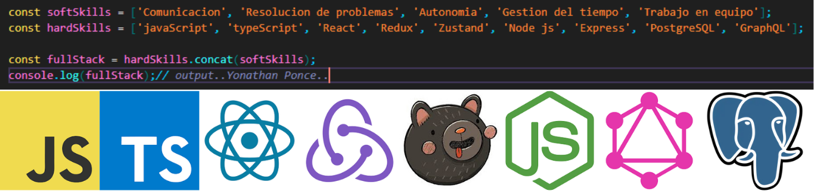

    
    

         
        

            <strong><h1>Quien soy?👨‍💼</h1></strong>
            Mi nombre es Yonathan Ponce y soy un desarrollador Full Stack. Soy un programador que esta en continuo aprendizaje y disfruto usar mis habilidades para contribuir a proyectos tecnológicos. Me caracterizo por ser una persona disciplinada, responsable y aplicada. Soy un hombre apasionado por la musica, los viajes y la comida tipica de mi pais Colombia. Me gustan los retos y el trabajo en equipo
        

        <strong><h1>Tecnologias💻:</h1></strong>
              <table>
            <tr>
                <td><ul><li>HTML5</li></ul></td>
                <td><ul><li>CSS3</li></ul></td>
                <td><ul><li>Tailwind CSS</li></ul></td>
            </tr>
            <tr>
                <td><ul><li>JavaScript</li></ul></td>
                <td><ul><li>TypeScript</li></ul></td>
                <td><ul><li>React JS</li></ul></td>
            </tr>
            <tr>
                <td><ul><li>Redux</li></ul></td>
                <td><ul><li>Zustand</li></ul></td>
                <td><ul><li>Node JS</li></ul></td>
            </tr>
            <tr>
                <td><ul><li>Express JS</li></ul></td>
                <td><ul><li>Sequelize</li></ul></td>
                <td><ul><li>GraphQL</li></ul></td>
            </tr>
        </table>
    

